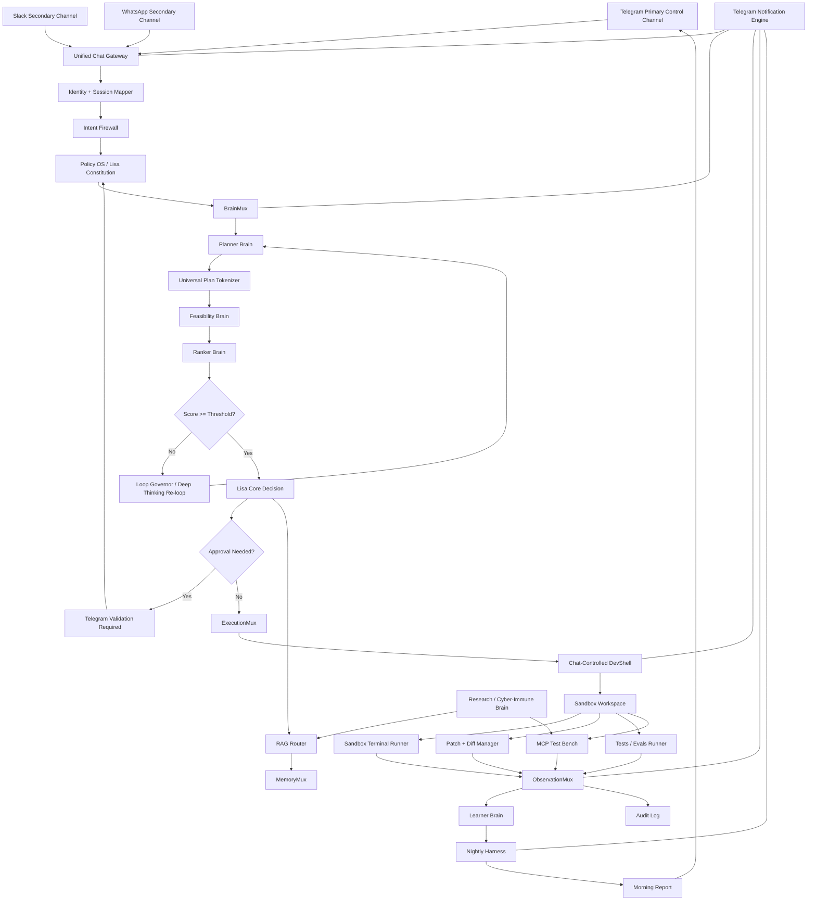

# Lisa

**Lisa** is a chat-native, self-improving agentic assistant designed to operate through **Telegram, Slack, and WhatsApp only**.

Lisa is not a normal web dashboard. Lisa is an agentic operating core with controlled planning, strict governance, sandboxed development, RAG-backed memory, MCP quarantine, and mandatory Telegram transparency for every meaningful environment update.

> **Core principle:** Brains reason. Multiplexers route. Policy decides authority. Sandbox executes. Telegram reports everything.

---

## What Lisa Is

Lisa is designed as a long-term personal agentic assistant with:

- A controlled three-brain ReAct planning loop.
- A Universal Plan Tokenizer to reduce token pressure between brains.
- A strict Policy OS and constitution.
- A chat-controlled DevShell for sandboxed self-improvement.
- RAG pipelines with trust zones.
- MCP discovery and quarantine before activation.
- MQTT-based lightweight eventing.
- Mandatory Telegram notifications for every meaningful update.
- Human validation for crucial workspace, memory, MCP, skill, connector, and execution changes.

Lisa should grow in capability, but never through unrestricted autonomy.

---

## User-Facing Interfaces

Lisa has only three user-facing channels:

```txt
Telegram  - primary control, validation, and live update channel
Slack     - secondary team/workspace channel
WhatsApp  - secondary mobile command channel
```

There is **no traditional web dashboard**.

All interaction must happen through chat commands, approval replies, diff summaries, test summaries, and safe artifact references.

---

## Current Build Phase

This repository starts with the **planning and documentation phase**.

The first implementation target is:

```txt
Chat command
→ Unified Chat Gateway
→ Intent Firewall
→ Planner Brain
→ Universal Plan Tokenizer
→ Feasibility Brain
→ Ranker Brain
→ Threshold check
→ Re-loop if needed
→ Final plan packet
→ Telegram update
```

No real-world destructive execution is allowed in the initial phase.

---

## Core Architecture



---

## Brain System

Lisa starts with three active planning brains:

| Brain | Role |
|---|---|
| Planner Brain | Creates structured task plans. |
| Feasibility Brain | Checks realism, missing access, infra limits, and safety. |
| Ranker Brain | Scores plan quality and decides whether replanning is required. |

Later brains:

| Brain | Role |
|---|---|
| Learner Brain | Learns from traces, failures, and test results. |
| Research / Cyber-Immune Brain | Tracks tools, MCPs, papers, risks, and external ecosystem changes. |
| Red Team Mirror | Reviews risky actions for abuse paths and blast radius. |

---

## Mandatory Telegram Transparency

Lisa must notify the user through Telegram for every meaningful update:

- Active brain change.
- Plan creation.
- Plan compression.
- Feasibility result.
- Ranker score.
- Loop re-run.
- Threshold pass/fail.
- DevShell command start/completion/block.
- File change.
- Diff creation.
- Test result.
- MCP scan/test.
- Skill candidate creation.
- Memory promotion request.
- Circuit breaker event.
- Rollback creation.
- Nightly report.

Crucial updates require validation before execution.

> **No silent action. No hidden brain state. No crucial update without Telegram validation.**

---

## Documentation Index

Read these in order:

1. [`docs/00_vision.md`](docs/00_vision.md)
2. [`docs/01_chat_native_architecture.md`](docs/01_chat_native_architecture.md)
3. [`docs/02_react_planning_loop.md`](docs/02_react_planning_loop.md)
4. [`docs/03_universal_plan_tokenizer.md`](docs/03_universal_plan_tokenizer.md)
5. [`docs/04_rag_pipeline.md`](docs/04_rag_pipeline.md)
6. [`docs/05_policy_os.md`](docs/05_policy_os.md)
7. [`docs/06_mqtt_protocol.md`](docs/06_mqtt_protocol.md)
8. [`docs/07_chat_controlled_devshell.md`](docs/07_chat_controlled_devshell.md)
9. [`docs/08_telegram_transparency_layer.md`](docs/08_telegram_transparency_layer.md)
10. [`docs/09_security_model.md`](docs/09_security_model.md)
11. [`docs/10_lightweight_deployment.md`](docs/10_lightweight_deployment.md)
12. [`docs/11_developer_execution_plan.md`](docs/11_developer_execution_plan.md)
13. [`docs/12_roadmap.md`](docs/12_roadmap.md)

---

## Recommended Initial Stack

```txt
Backend: FastAPI
Database: SQLite for dev, Postgres for production
Messaging: Optional MQTT
Chat: Telegram Bot API, Slack App, WhatsApp Cloud API
LLM: Provider-configurable router
RAG: Trust-zoned document pipeline
Sandbox: isolated local workspace first, container/microVM later
```

---

## Non-Negotiable Rules

```txt
No web dashboard.
No unrestricted shell.
No direct host command execution.
No direct production write.
No direct MCP activation.
No direct trusted memory write from brains.
No direct tool execution from brains.
No self-modification of constitution or policy core.
No external write without approval.
No secrets in logs, prompts, MQTT events, traces, chat messages, or memory.
No infinite loops.
No hardcoded model/provider/threshold logic in business logic.
```

---

## Status

Lisa is currently in **architecture and planning documentation phase**.

Next milestone: implement the chat-native FastAPI foundation, Telegram webhook, task runtime, policy loader, and three-brain planning loop.
