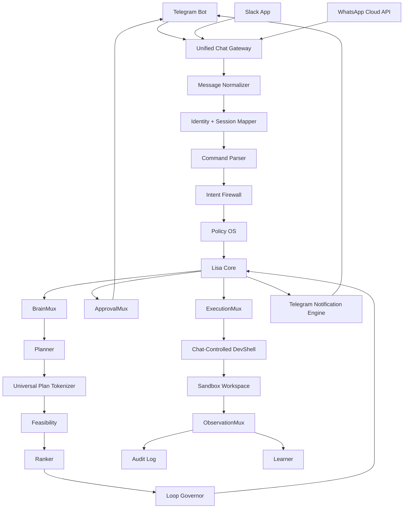

# Chat-Native Architecture

Lisa has no traditional browser dashboard.

All user-facing control happens through:

```txt
Telegram
Slack
WhatsApp
```

Telegram is the primary operational channel and must receive the most detailed updates.

---

## 1. High-Level Architecture



---

## 2. Unified Chat Gateway

The Unified Chat Gateway converts all platform-specific messages into one internal command format.

Input sources:

- Telegram webhook.
- Slack Events API.
- WhatsApp Cloud API webhook.

Internal normalized shape:

```json
{
  "message_id": "string",
  "channel": "telegram | slack | whatsapp",
  "external_user_id": "string",
  "external_chat_id": "string",
  "workspace_id": "string | null",
  "text": "string",
  "attachments": [],
  "timestamp": "datetime",
  "raw_payload_ref": "string"
}
```

No brain should receive raw Telegram, Slack, or WhatsApp payloads directly.

---

## 3. Chat Command Model

Lisa should support slash-style commands where possible:

```txt
/lisa plan <task>
/lisa status <task_id>
/lisa approve <approval_id>
/lisa deny <approval_id>
/lisa explain <task_id>
/lisa diff <session_id>
/lisa run-tests <session_id>
/lisa devshell start
/lisa devshell terminal <session_id> <command>
/lisa mcp scan <source>
/lisa nightly run
/lisa morning-report
```

WhatsApp must also support natural language aliases:

```txt
Lisa plan this: ...
Approve this
Deny this
Show the diff
Run tests first
Start devshell
```

---

## 4. Response Rendering

Each channel has different capabilities.

### Telegram

- Primary live control channel.
- Use concise structured messages.
- Use inline keyboard buttons where possible.
- Send every meaningful operational update.

### Slack

- Use Block Kit-style structured responses where possible.
- Useful for team/workspace visibility.
- Can show approval buttons, summaries, and task cards.

### WhatsApp

- Keep messages short.
- Use numbered options for approvals.
- Avoid huge outputs.

---

## 5. No Dashboard Rule

Do not build:

- Web dashboard.
- Browser code editor.
- Browser terminal.
- Frontend control panel.

DevShell is controlled through chat commands and safe artifacts.

---

## 6. Internal Routes

Public webhook routes:

```txt
GET  /api/health
POST /webhooks/telegram
POST /webhooks/slack/events
POST /webhooks/whatsapp
GET  /webhooks/whatsapp
```

Internal protected routes:

```txt
POST /internal/tasks
GET  /internal/tasks/{task_id}
POST /internal/tasks/{task_id}/plan
GET  /internal/tasks/{task_id}/events
POST /internal/devshell/sessions
POST /internal/nightly/run
```

Internal routes must be protected by internal auth.

---

## 7. Success Criteria

The architecture is correct when:

- Telegram, Slack, and WhatsApp normalize into the same command shape.
- Lisa can plan from chat.
- Lisa can request approval through chat.
- Telegram receives operational updates.
- No browser dashboard exists.
- No raw channel payload enters the brain layer.
