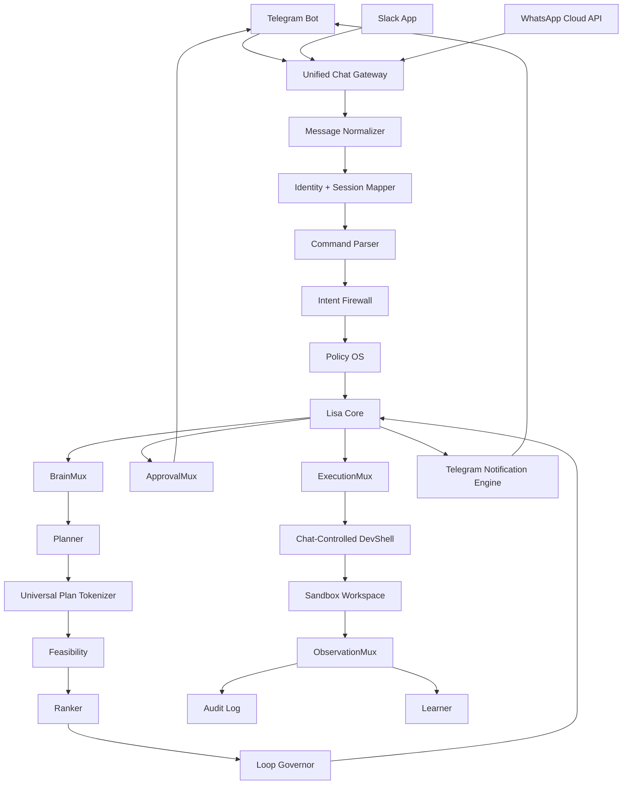

# Chat-Native Architecture

Lisa has no traditional browser dashboard.

All user-facing control happens through:

```txt
Telegram
Slack
WhatsApp
```

Telegram is the primary operational channel and must receive the most detailed updates.

---

## 1. High-Level Architecture



---

## 2. Unified Chat Gateway

The Unified Chat Gateway converts all platform-specific messages into one internal command format.

Input sources:

- Telegram webhook.
- Slack Events API.
- WhatsApp Cloud API webhook.

Internal normalized shape:

```json
{
  "message_id": "string",
  "channel": "telegram | slack | whatsapp",
  "external_user_id": "string",
  "external_chat_id": "string",
  "workspace_id": "string | null",
  "text": "string",
  "attachments": [],
  "timestamp": "datetime",
  "raw_payload_ref": "string"
}
```

No brain should receive raw Telegram, Slack, or WhatsApp payloads directly.

---

## 3. Chat Command Model

Lisa should support slash-style commands where possible:

```txt
/lisa plan <task>
/lisa status <task_id>
/lisa approve <approval_id>
/lisa deny <approval_id>
/lisa explain <task_id>
/lisa diff <session_id>
/lisa run-tests <session_id>
/lisa devshell start
/lisa devshell terminal <session_id> <command>
/lisa mcp scan <source>
/lisa nightly run
/lisa morning-report
```

WhatsApp must also support natural language aliases:

```txt
Lisa plan this: ...
Approve this
Deny this
Show the diff
Run tests first
Start devshell
```

---

## 4. Response Rendering

Each channel has different capabilities.

### Telegram

- Primary live control channel.
- Use concise structured messages.
- Use inline keyboard buttons where possible.
- Send every meaningful operational update.

### Slack

- Use Block Kit-style structured responses where possible.
- Useful for team/workspace visibility.
- Can show approval buttons, summaries, and task cards.

### WhatsApp

- Keep messages short.
- Use numbered options for approvals.
- Avoid huge outputs.

---

## 5. No Dashboard Rule

Do not build:

- Web dashboard.
- Browser code editor.
- Browser terminal.
- Frontend control panel.

DevShell is controlled through chat commands and safe artifacts.

---

## 6. Internal Routes

Public webhook routes:

```txt
GET  /api/health
POST /webhooks/telegram
POST /webhooks/slack/events
POST /webhooks/whatsapp
GET  /webhooks/whatsapp
```

Internal protected routes:

```txt
POST /internal/tasks
GET  /internal/tasks/{task_id}
POST /internal/tasks/{task_id}/plan
GET  /internal/tasks/{task_id}/events
POST /internal/devshell/sessions
POST /internal/nightly/run
```

Internal routes must be protected by internal auth.

---

## 7. Success Criteria

The architecture is correct when:

- Telegram, Slack, and WhatsApp normalize into the same command shape.
- Lisa can plan from chat.
- Lisa can request approval through chat.
- Telegram receives operational updates.
- No browser dashboard exists.
- No raw channel payload enters the brain layer.


## Lisa 7-Brain Architecture

Lisa’s planning core starts with Planner, Feasibility, and Ranker.
Lisa’s full governance, learning, safety, and audit architecture has 7 brains.

### 1. Planner Brain

The Planner Brain is responsible for turning a user goal into a structured implementation plan.

Responsibilities:

```txt
- interpret the user request
- define the goal
- break the goal into ordered steps
- list assumptions
- list constraints
- identify required modules/tools
- identify expected outputs
- identify likely risks
- mark steps that may require approval
- produce a structured plan packet for UPT compression
```

The Planner Brain must not execute tools directly.

---

### 2. Feasibility Brain

The Feasibility Brain is responsible for checking whether the Planner’s plan is realistic, safe, and executable.

Responsibilities:

```txt
- check if the plan can run on Lisa’s current architecture
- check missing files, modules, services, policies, or permissions
- check lightweight deployment viability
- check dependency and infrastructure assumptions
- check if the plan violates chat-native constraints
- check if Telegram validation is needed
- check if sandboxing is required
- identify blockers before execution
- produce a feasibility report
```

The Feasibility Brain must not silently approve risky work.

---

### 3. Ranker Brain

The Ranker Brain is responsible for scoring the plan and deciding whether the planning loop should re-run.

Responsibilities:

```txt
- score feasibility
- score clarity
- score risk control
- score token efficiency
- score lightweight deployment readiness
- score implementation readiness
- decide whether re-loop is required
- provide required improvements
- preserve good parts of the previous plan
- produce a final score and replan decision
```

The Ranker Brain must use policy-driven thresholds, not hardcoded values.

---

### 4. Teacher / Learner Brain

Responsible for teaching and improving the first three brains. It must run Lisa Night School.

Responsibilities:

```txt
- study task traces
- mine mistakes
- teach Planner, Feasibility, and Ranker
- run internal debates
- quiz each brain
- generate training examples
- create prompt improvement candidates
- create rubric improvement candidates
- create skill candidates
- create tests/evals
- send morning learning reports to Telegram
```

The Teacher Brain must not directly modify active prompts, active skills, trusted memory, policies, or constitution. It can only propose improvements.

---

### 5. Cyber-Immune / World-Interaction Brain

Responsible for interacting with the outside world safely.

Responsibilities:

```txt
- research external tools
- inspect packages
- scan npm/PyPI packages
- scan GitHub repos
- scan MCP servers
- detect typosquatting
- detect malicious install scripts
- detect prompt injection
- detect poisoned docs
- detect unsafe dependencies
- write external content only to quarantine
- generate trust scores
- recommend safe/unsafe decision
- notify Telegram before and after every scan
```

The Cyber-Immune Brain must not install packages directly, activate MCPs directly, or write trusted memory directly.

---

### 6. Red Team Mirror / Safety Critic Brain

The Red Team Mirror is responsible for adversarial review of risky plans.

Responsibilities:

```txt
- inspect plans for abuse paths
- inspect package/MCP/tool risks
- check blast radius
- check prompt-injection exposure
- check permission escalation risk
- check if rollback is required
- challenge unsafe assumptions
- recommend blocking, approval, sandboxing, or re-planning
- escalate high-risk actions to Policy OS
```

The Red Team Mirror must not execute tools, install packages, activate MCPs, or modify memory. It only critiques, escalates, and protects.

---

### 7. Auditor / School Inspector Brain

Responsible for evaluating the learning system. The Teacher teaches; the Auditor grades and tracks.

Responsibilities:

```txt
- observe brain behavior patterns
- track brain learning curves
- track effectiveness
- track token efficiency
- track repeated mistakes
- track skill adoption
- generate report cards
- generate marksheets
- update Agent Memo
- track old skill replacement with improved skills
- recommend capability allocation
- recommend MCP/package/tool access based on brain readiness
- send school audit report to Telegram
```

The Auditor Brain must not teach directly, install packages, activate MCPs, or replace skills directly. It only evaluates, records, recommends, and reports.
