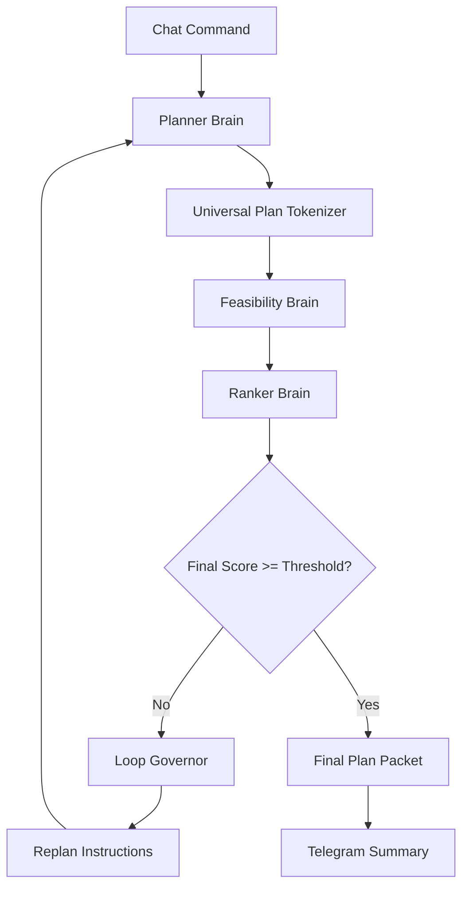

# ReAct Planning Loop

Lisa's first intelligence layer is a controlled three-brain ReAct-style planning loop.

The goal is to make Lisa think deeply before execution.

---

## 1. Loop Overview

```txt
User command
→ Planner Brain
→ Universal Plan Tokenizer
→ Feasibility Brain
→ Ranker Brain
→ Threshold check
→ Re-loop if score is low
→ Final plan packet
```

---

## 2. Visual Flow



---

## 3. Brain Responsibilities

### Planner Brain

Creates:

- Goal interpretation.
- Step-by-step plan.
- Assumptions.
- Constraints.
- Required tools/modules.
- Risks.
- Expected outputs.
- Tests and docs required.

### Feasibility Brain

Checks:

- Can this be implemented?
- Can it run on a lightweight instance?
- Are required tools available?
- Does it violate policy?
- Is there missing access?
- Is the plan too broad?
- Does it need approval?

### Ranker Brain

Scores:

```json
{
  "feasibility_score": 0,
  "clarity_score": 0,
  "risk_control_score": 0,
  "token_efficiency_score": 0,
  "lightweight_deploy_score": 0,
  "implementation_readiness_score": 0,
  "final_score": 0,
  "replan_required": false,
  "required_improvements": [],
  "must_preserve": []
}
```

---

## 4. Threshold Policy

Loop thresholds must live in:

```txt
backend/app/policies/planning_loop.yaml
```

Example:

```yaml
planning_loop:
  max_iterations: 4
  minimum_final_score: 8.0
  minimum_feasibility_score: 7.5
  maximum_risk_score: 6.0
  stagnation_limit: 2
  max_tokens_per_iteration: 12000
  max_total_tokens_per_task: 50000
```

No thresholds should be hardcoded in Python business logic.

---

## 5. Stop Conditions

Stop successfully when:

- final score passes threshold.
- feasibility passes threshold.
- risk is acceptable.
- Ranker marks plan as ready.

Stop safely when:

- max iterations reached.
- same weakness repeats twice.
- risk increases without mitigation.
- token budget exceeded.
- required access missing.
- policy violation detected.
- user validation is required.

---

## 6. Telegram Updates

Each loop stage must notify Telegram.

Examples:

```txt
🧠 Brain Switch
Previous: Planner Brain
Now Active: Feasibility Brain
Reason: Planner created plan_packet pp_003.
```

```txt
📊 Ranker Score
Task: task_104
Iteration: 2
Final Score: 7.4 / 10
Decision: Re-loop required
Reason: Missing rollback strategy and weak token control.
```

---

## 7. Required Files

```txt
backend/app/brains/planner.py
backend/app/brains/feasibility.py
backend/app/brains/ranker.py
backend/app/loop/react_loop.py
backend/app/loop/loop_governor.py
backend/app/loop/threshold_policy.py
backend/app/policies/planning_loop.yaml
```

---

## 8. Tests

Required tests:

- Planner returns structured plan.
- Feasibility returns structured report.
- Ranker returns valid score.
- Loop repeats when score is low.
- Loop stops when threshold passes.
- Loop stops at max iterations.
- Loop stops on token budget breach.
- Telegram notification emits on brain switch.
