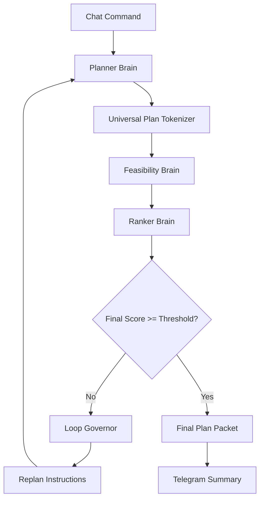

# ReAct Planning Loop

Lisa’s live planning loop starts with Planner, Feasibility, and Ranker. For risky plans, the Red Team Mirror joins as a safety critic before approval or execution.

The goal is to make Lisa think deeply before execution.

---

## 1. Loop Overview

```txt
User command
→ Planner Brain
→ Universal Plan Tokenizer
→ Feasibility Brain
→ Ranker Brain
→ Threshold check
→ Re-loop if score is low
→ Final plan packet
```

---

## 2. Visual Flow



---

## 3. Brain Responsibilities

### Planner Brain

The Planner Brain is responsible for turning a user goal into a structured implementation plan.

Responsibilities:

```txt
- interpret the user request
- define the goal
- break the goal into ordered steps
- list assumptions
- list constraints
- identify required modules/tools
- identify expected outputs
- identify likely risks
- mark steps that may require approval
- produce a structured plan packet for UPT compression
```

The Planner Brain must not execute tools directly.

### Feasibility Brain

The Feasibility Brain is responsible for checking whether the Planner’s plan is realistic, safe, and executable.

Responsibilities:

```txt
- check if the plan can run on Lisa’s current architecture
- check missing files, modules, services, policies, or permissions
- check lightweight deployment viability
- check dependency and infrastructure assumptions
- check if the plan violates chat-native constraints
- check if Telegram validation is needed
- check if sandboxing is required
- identify blockers before execution
- produce a feasibility report
```

The Feasibility Brain must not silently approve risky work.

### Ranker Brain

The Ranker Brain is responsible for scoring the plan and deciding whether the planning loop should re-run.

Responsibilities:

```txt
- score feasibility
- score clarity
- score risk control
- score token efficiency
- score lightweight deployment readiness
- score implementation readiness
- decide whether re-loop is required
- provide required improvements
- preserve good parts of the previous plan
- produce a final score and replan decision
```

The Ranker Brain must use policy-driven thresholds, not hardcoded values.

### Red Team Mirror / Safety Critic Brain

The Red Team Mirror is responsible for adversarial review of risky plans.

Responsibilities:

```txt
- inspect plans for abuse paths
- inspect package/MCP/tool risks
- check blast radius
- check prompt-injection exposure
- check permission escalation risk
- check if rollback is required
- challenge unsafe assumptions
- recommend blocking, approval, sandboxing, or re-planning
- escalate high-risk actions to Policy OS
```

The Red Team Mirror must not execute tools, install packages, activate MCPs, or modify memory.

It only critiques, escalates, and protects.

## 4. Threshold Policy

Loop thresholds must live in:

```txt
backend/app/policies/planning_loop.yaml
```

Example:

```yaml
planning_loop:
  max_iterations: 4
  minimum_final_score: 8.0
  minimum_feasibility_score: 7.5
  maximum_risk_score: 6.0
  stagnation_limit: 2
  max_tokens_per_iteration: 12000
  max_total_tokens_per_task: 50000
```

No thresholds should be hardcoded in Python business logic.

---

## 5. Stop Conditions

Stop successfully when:

- final score passes threshold.
- feasibility passes threshold.
- risk is acceptable.
- Ranker marks plan as ready.

Stop safely when:

- max iterations reached.
- same weakness repeats twice.
- risk increases without mitigation.
- token budget exceeded.
- required access missing.
- policy violation detected.
- user validation is required.

---

## 6. Telegram Updates

Each loop stage must notify Telegram.

Examples:

```txt
🧠 Brain Switch
Previous: Planner Brain
Now Active: Feasibility Brain
Reason: Planner created plan_packet pp_003.
```

```txt
📊 Ranker Score
Task: task_104
Iteration: 2
Final Score: 7.4 / 10
Decision: Re-loop required
Reason: Missing rollback strategy and weak token control.
```

---

## 7. Required Files

```txt
backend/app/brains/planner.py
backend/app/brains/feasibility.py
backend/app/brains/ranker.py
backend/app/loop/react_loop.py
backend/app/loop/loop_governor.py
backend/app/loop/threshold_policy.py
backend/app/policies/planning_loop.yaml
```

---

## 8. Tests

Required tests:

- Planner returns structured plan.
- Feasibility returns structured report.
- Ranker returns valid score.
- Loop repeats when score is low.
- Loop stops when threshold passes.
- Loop stops at max iterations.
- Loop stops on token budget breach.
- Telegram notification emits on brain switch.
