# RAG Pipeline

Lisa uses Retrieval-Augmented Generation, but not as one unstructured memory dump.

Lisa must use multiple trust-zoned RAG pipelines so that policies, skills, traces, research, and MCP data do not contaminate each other.

---

## 1. RAG Categories

```txt
policy
skill
trace
project
research
mcp_connector
user_preference
```

Each category has a different trust level and retrieval policy.

---

## 2. Trust Zones

```txt
trusted       - approved internal knowledge
working       - temporary task-specific context
quarantine    - scanned but unapproved external content
raw           - untrusted external data
```

External content must never enter trusted context directly.

---

## 3. Pipeline Flow

```mermaid
flowchart LR
    SRC[Source] --> ING[Ingestion]
    ING --> CLASS[Classification]
    CLASS --> SAN[Sanitization]
    SAN --> CHUNK[Chunking]
    CHUNK --> META[Metadata Extraction]
    META --> EMBED[Embedding]
    EMBED --> STORE[Vector Store]
    STORE --> RET[Retriever]
    RET --> FILTER[Trust + Policy Filter]
    FILTER --> COMP[Context Compressor]
    COMP --> BRAIN[Brain-Specific Context]
```



---

## 4. Chunk Metadata

Every chunk must include:

```json
{
  "doc_id": "string",
  "source_type": "policy | skill | trace | project | research | mcp_connector | user_preference",
  "trust_zone": "trusted | quarantine | raw | working",
  "source_url": null,
  "permissions": [],
  "allowed_brains": [],
  "sensitivity": "low | medium | high",
  "chunk_type": "string",
  "content": "string"
}
```

---

## 5. Retrieval Rules

No brain receives raw RAG dumps.

Retrieval must pass through:

```txt
RAG Router
→ Policy filter
→ Trust filter
→ Relevance ranker
→ Context compressor
→ Brain-specific context view
```

---

## 6. RAG Category Rules

### Policy RAG

Trusted only from local policy files.

Used by:

- Policy OS
- Feasibility Brain
- Ranker Brain
- Red Team Mirror

### Skill RAG

Stores:

- Active skills
- Candidate skills
- Skill eval results
- Skill failure history

### Trace RAG

Stores:

- Past task summaries
- Plan versions
- Scores
- Tool summaries
- Token usage
- User feedback

### Research RAG

Stores:

- Paper summaries
- Protocol notes
- Security reports
- Framework comparisons

Research RAG is quarantine-first.

### MCP Connector RAG

Stores:

- MCP manifests
- Tool schemas
- Tool descriptions
- Permission requests
- Scan results
- Trust scores

---

## 7. Required Files

```txt
backend/app/rag/ingestion.py
backend/app/rag/chunker.py
backend/app/rag/embeddings.py
backend/app/rag/vector_store.py
backend/app/rag/retriever.py
backend/app/rag/rag_router.py
backend/app/rag/context_compressor.py
backend/app/policies/rag_policy.yaml
backend/app/schemas/rag_chunk.schema.json
```

---

## 8. Tests

Required tests:

- Policy files ingest as trusted.
- External research ingests as quarantine.
- Raw external content cannot enter trusted context.
- Retrieval respects allowed brains.
- Context compressor reduces large chunks.
- RAG query returns metadata with trust zone.
