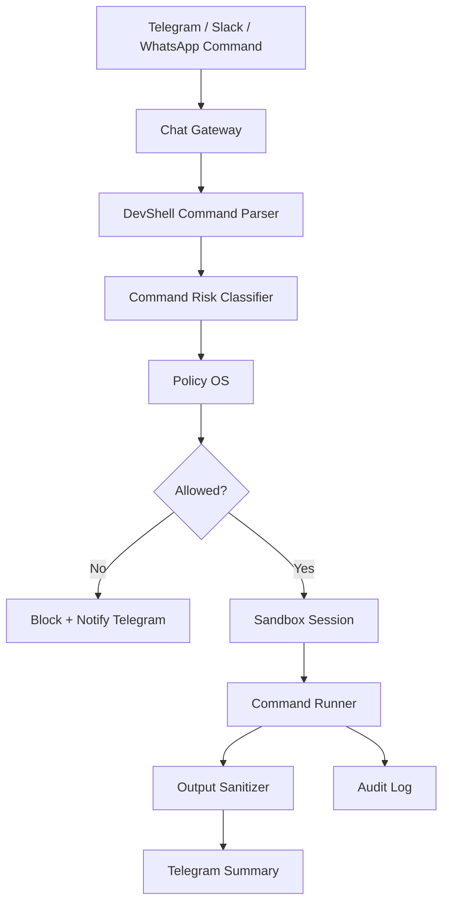

# Chat-Controlled DevShell

Lisa does not have a browser editor or web terminal.

DevShell is controlled through Telegram, Slack, and WhatsApp.

Telegram is the primary DevShell control channel.

---

## 1. Purpose

DevShell allows Lisa and the user to safely:

- Create candidate skills.
- Edit docs and lessons.
- Inspect sandbox files.
- Run tests.
- Run safe scripts.
- Generate diffs.
- Test MCP candidates.
- Package improvements.

DevShell must never become unrestricted host shell access.

---

## 2. DevShell Flow



---

## 3. DevShell Modes

```txt
READ_ONLY_MODE
SKILL_CANDIDATE_MODE
MCP_TEST_MODE
LEARNING_SCRIPT_MODE
PATCH_PROPOSAL_MODE
APPROVAL_REQUIRED_MODE
```

Default mode:

```txt
READ_ONLY_MODE
```

---

## 4. Allowed Editable Areas

```txt
skills/candidates/*
evals/*
lessons/*
docs/*
sandbox_workspaces/*
mcp_candidates/*
test_fixtures/*
```

---

## 5. Blocked Direct Edits

```txt
backend/app/policies/constitution.yaml
backend/app/policy_os/*
backend/app/mux/tool_mux.py
backend/app/mux/memory_mux.py
backend/app/policy_os/permission_engine.py
.env
secrets/*
production/*
deployment/*
```

Core changes must follow:

```txt
proposal → diff → tests → approval → PR
```

---

## 6. Command Classes

Allowed command classes:

- File inspection.
- Safe grep/find.
- Test execution.
- Lint execution.
- Safe script execution.
- Package install inside sandbox only.
- git diff/status only.

Blocked by default:

```txt
sudo
su
docker
kubectl
ssh
scp
unrestricted curl/wget
rm -rf
chmod 777
git push
git commit to main
env
printenv
cat .env
network scanning
background persistence commands
```

---

## 7. Chat Commands

```txt
/lisa devshell start
/lisa devshell stop <session_id>
/lisa devshell ls <session_id> <path>
/lisa devshell cat <session_id> <path>
/lisa devshell edit <session_id> <path>
/lisa devshell terminal <session_id> <command>
/lisa devshell patch <session_id>
/lisa run-tests <session_id>
/lisa diff <session_id>
```

---

## 8. Telegram Updates

Every DevShell action must notify Telegram.

Example:

```txt
🖥️ DevShell Command Started
Task: task_184
Session: ds_022
Active Brain: DevShell
Command: pytest backend/app/tests/test_loop.py
Risk: P1
Decision: Allowed in sandbox
Next: Running command now.
```

---

## 9. Required Files

```txt
backend/app/devshell/chat_devshell.py
backend/app/devshell/workspace_manager.py
backend/app/devshell/terminal_gateway.py
backend/app/devshell/sandbox_session.py
backend/app/devshell/file_tree.py
backend/app/devshell/patch_manager.py
backend/app/devshell/package_runner.py
backend/app/devshell/skill_workspace.py
backend/app/devshell/mcp_testbench.py
backend/app/devshell/devshell_policy.py
backend/app/devshell/eval_runner.py
backend/app/devshell/diff_reviewer.py
backend/app/devshell/command_risk_classifier.py
```

---

## 10. Tests

Required tests:

- DevShell starts sandbox session.
- DevShell blocks forbidden command.
- DevShell cannot read .env.
- DevShell cannot edit constitution directly.
- DevShell can edit skill candidates.
- DevShell can run tests in sandbox.
- Patch proposal creates diff, not direct production change.
- Terminal output is sanitized.
- Telegram receives DevShell updates.
