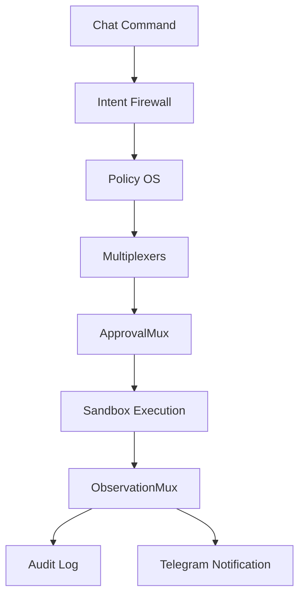

# Security Model

Lisa is designed to become powerful without becoming dangerous.

The security model is based on least privilege, chat validation, sandboxing, trusted memory promotion, MCP quarantine, and complete auditability.

---

## 1. Core Security Rules

```txt
No web dashboard.
No unrestricted shell.
No host command execution.
No direct production write.
No direct MCP activation.
No direct trusted memory write from brains.
No direct tool execution from brains.
No self-modification of constitution or policy core.
No external write without approval.
No secrets in logs, prompts, MQTT events, traces, chat messages, or memory.
No infinite loops.
No silent actions.
```

---

## 2. Defense Layers



---

## 3. Permission Levels

```txt
P0 observe
P1 draft
P2 sandbox_write
P3 external_write
P4 production_write
P5 irreversible_or_sensitive
```

P3+ requires approval.

P4 requires tests and rollback.

P5 is denied by default unless explicitly validated and allowed by policy.

---

## 4. MCP Security

MCPs are treated as untrusted until proven safe.

MCP lifecycle:

```txt
discover
→ quarantine
→ source reputation check
→ manifest scan
→ prompt/tool poisoning scan
→ dependency scan
→ permission diff
→ sandbox runtime test
→ trust score
→ validation
→ limited activation
```

No MCP can:

- Read secrets.
- Write trusted memory.
- Modify constitution.
- Access host filesystem.
- Open unrestricted shell.
- Activate itself.

---

## 5. Memory Security

Memory zones:

```txt
working_memory
episodic_memory
semantic_memory
skill_memory
mistake_memory
research_memory
quarantine_memory
trusted_memory
```

External content must enter quarantine first.

Chat messages are not automatically trusted.

Research content is not automatically trusted.

Trusted memory promotion requires policy checks and, for crucial cases, Telegram validation.

---

## 6. DevShell Security

DevShell is sandbox-only.

Blocked by default:

```txt
sudo
su
docker
kubectl
ssh
scp
unrestricted curl/wget
rm -rf
chmod 777
git push
git commit to main
env
printenv
cat .env
network scanning
background persistence commands
```

DevShell cannot directly edit:

```txt
constitution.yaml
policy_os/*
tool_mux.py
memory_mux.py
permission_engine.py
.env
secrets/*
production/*
deployment/*
```

---

## 7. Transparency as Security

Lisa must tell the user what is happening.

Telegram transparency is a security boundary.

If Lisa cannot explain:

- Which brain is active.
- What it changed.
- Why it changed it.
- What happens next.

then the task should pause.

---

## 8. Required Tests

- P3+ action blocks for approval.
- P5 denied by default.
- ToolMux denies unknown tools.
- DevShell blocks forbidden command.
- DevShell cannot read .env.
- MemoryMux blocks raw-to-trusted promotion.
- MCP cannot activate without scan and validation.
- Silent action triggers circuit breaker.
- Secrets are redacted from notifications and logs.
